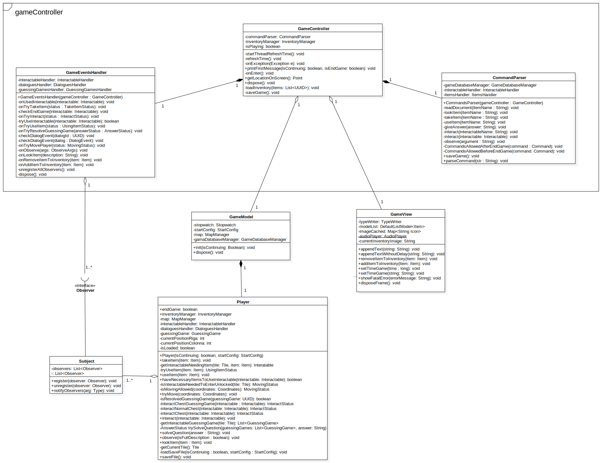

# Relazione tecnica finale

 ### Indice

<br/>

1. [Introduzione](#introduzione)
  * [Trama](#trama)
  * [Mappa](#mappa)
2. [Requisiti specifici](#requisiti-specifici)
  * [Requisiti funzionali](#requisiti-funzionali)
  * [Requisiti non funzionali](#requisiti-non-funzionali)
3. [System Design](#system-Design)
  * [Pattern e stile architetturale utilizzati](#pattern-e-stile-architetturale-utilizzati)
4. [Dettagli implementativi e tecnologie utilizzate](#dettagli-implementativi-e-tecnologie-utilizzate)
5. [Specifica algebrica di una struttura dati utilizzata](#specifica-algebrica-di-una-struttura-dati-utilizzata)
6. [Diagramma di una classe significativa](#diagramma-di-una-classe-significativa)
7. [Soluzione completa del gioco](#soluzione-completa-del-gioco)
8. [Dettegli sulla compilazione](#dettagli-sulla-compilazione)
9. [Organizzazione del lavoro e strumenti utilizzati](#organizzazione-del-lavoro-e-strumenti-utilizzati)
  * [Piattaforme di comunicazione](#piattaforme-di-comunicazione)
10. [Conclusione](#conclusione)

<br/><br/>


## **Introduzione**

Questo documento è la relazione tecnica finale per il progetto che implementa il gioco **EURUS**.

L'obiettivo di questo progetto è quello di dimostrare le competenze acquisiste durante il corso di Metodi Avanzati di Programmazione A.A. 2020/2021, tenuto dal Professor **[Pierpaolo Basile](http://www.di.uniba.it/~swap/index.php?n=Membri.Basile)**.

Lo scopo di questo progetto è quello di creare un'avventura testuale, scritta in Java, che potrà essere giocata da tutti coloro i quali hanno una conoscenza almeno dilettantistica del suo funzionamento.

L'applicativo software, oggetto del documento, è stato sviluppato dal gruppo **[Athena's devs]()**, composto da:

* **[Riccardo Ranieri](https://github.com/RickNewere)**
* **[Giuliano Picilli](https://github.com/Giuly123)**
* **[Fabio Spaccavento](https://github.com/fabiospaccavento)**


## **Trama**

Eurus è un avventura testuale ispirata alla serie BBC ```Sherlock```. Riuscirai a risolvere il problema finale? Scoprilo accompagnando i protagonisti nel Gioco! (due finali disponibili).

## **Mappa**

<center></center>

[Torna all'indice](#indice)
<br/>

## **Requisiti specifici**

Di seguito l'elenco dei requisiti specifici (funzionali e non funzionali):

## **Requisiti funzionali**

Avviata l'applicazione ci troveremo nel Main Menu.

<center></center>

Abbiamo tre pulsanti:

* ```New Game```: comincia una nuova partita.
* ```Load Game```: riprende l'ultima partita salvata, se ne è stata salvata una.
* ```Exit```: chiude l'applicazione.

Iniziando o continuando una partita ci ritroveremo nella vera e propria schermata di gioco.

Il gioco sarà predisposto a ricevere comandi del tipo:

* ```help```: per mostrare la lista dei comandi disponibili.
* ```nord```/```su```/```n```: per far muovere il protagonista verso nord;
* ```sud```/```giu```/```s```: per far muovere il protagonista verso sud;
* ```est```/```sinistra```/```e```/```sx```: per far muovere il protagonista verso est;
* ```ovest```/```destra```/```o```/```dx```: per far muovere il protagonista verso ovest;
* ```interagisci[con][con il] + nome oggetto```: per aprire eventuali oggetti di tipo chest / chest dove è richiesto un pin / interagire con cadaveri o altri oggetti;
* ```leggi + nome oggetto```: per leggere oggetti di tipo documento;
* ```guarda + nome oggetto``` / ```osserva + nome oggetto```: per osservare l'oggetto. Mostra la descrizione dell'oggetto;
* ```osserva``` : per osservare la stanza in cui ti trovi. Questo comando ti darà più informazioni rispetto alla normale descrizione che apparirà una volta entrati in una determinata stanza;
* ```usa + nome oggetto```: per usare un oggetto presente nell'inventario;
* ```rispondi```: per rispondere ad indovinalli presenti nel gioco;
* ```prendi + nome oggetto```: per raccogliere un oggetto.

Un comando può essere formulato anche con diverse preposizioni. Ad esempio:

* ```prendi foglietto```
* ```prendi il foglietto```
* ```interagisci con il cadavere```
* ```interagisci con cadavere```
* ```interagisci cadavere```

Di tutti i comandi valgono anche i corrispettivi inglesi!

<center></center>


## **Requisiti non funzionali**

**Robustezza**

Il software prevede che l'utente conosca le regole generali di una avventura testuale. Il livello di protezione dagli errori dell'utente consiste nella rigorosa analisi dell'input con opportune notifiche di comandi o mosse errate.
Inoltre, l'applicazione gestisce tutte le eventuali eccezioni. Vi è anche un  pannello che in caso di Fatal Error  notifica all'utente il problema che si è verificato e forza la chiusura del gioco. Inoltre, viene salvato il problema in un file di log, chiamato ```errorLog.txt```, con la data, l'ora e l'eccezione generata.

**Estendibilità**

Il software è stato realizzato utilizzando le best practices del linguaggio **O.O. Java** ed è strutturato secondo il pattern architetturale **MVC**.
Il software è progettato in modo da poter consentire, con semplicitá, l'implementazione di altri comandi in futuro.

**Riusabilità**

Il software può essere reimpiegato per lo sviluppo di applicazioni. Infatti, basterà avere creatività e [modificare solo la storia](#json).

**Portabilità**

La JDK utilizzata per sviluppare l'avventura è stata la 8.0.

[Torna all'indice](#indice)
<br/>

## **System Design**

L'applicazione è interamente sviluppata in **[Java](https://www.java.com/it/)**. Questo è un linguaggio orientato agli oggetti, che permette l'esecuzione dei suoi applicativi su tutti i sistemi per cui è stata sviluppata una java virtual machine. L'intero progetto è contenuto all'interno di una repository pubblica su **[GitHub](https://github.com/)**. Inoltre, abbiamo utilizzato **[Maven](https://maven.apache.org/)** come sistema per l'automazione dello sviluppo e **[SpotBugs](https://spotbugs.github.io/)**, strumento utile per scovare bug nascosti nel codice. Per quest'ultimo, si è scelto di lasciar alcuni errori che ritenevamo non essere veri e propri bug. Inoltre, è stata generata anche la **[Javadoc](https://it.wikipedia.org/wiki/Javadoc)** del progetto. Questa è contenuta nella directory ```javadoc``` contenuta a sua volta nella directory ```doc```.

## **Pattern e stile architetturale utilizzati**

Il programma è stato progettato secondo il pattern architetturale **[MVC](https://it.wikipedia.org/wiki/Model-view-controller)** (Model - View - Controller). Abbiamo deciso di utilizzare questo pattern per disaccopiare la logica e i dati del gioco dalla logica d'interfacciamento con l'utente. 

Pertanto:

* **GameModel**

  Gestisce la logica e i dati dell'applicativo.

* **GameView**

  Gestisce l'interfacciamento con l'utente.

* **GameController**

  Interfaccia le due classi sopraccitate.

Inoltre, abbiamo affiancato al pattern MVC il Pattern
**[Observer](https://it.wikipedia.org/wiki/Observer_pattern)**, per mantenere un alto livello di consistenza fra classi correlate, senza produrre situazioni di forte dipendenza e di accoppiamento elevato.

Il pattern Observer permette di definire una dipendenza uno a molti fra oggetti, in modo tale che se un oggetto cambia il suo stato interno, ciascuno degli oggetti dipendenti da esso viene notificato e aggiornato automaticamente.

Il pattern Observer trova applicazione nei casi in cui diversi oggetti (Observer) devono conoscere lo stato di un oggetto (Subject).
In poche parole  abbiamo un oggetto che viene “osservato” (il subject) e tanti oggetti che “osservano” i cambiamenti di quest’ultimo (gli observers).

Abbiamo creato quindi:

* Un'interfaccia generica, chiamata ```Observer```;
* Una classe soggetto da osservare, chiamata ```Subject```;

L'applicazione di questo pattern è particolarmente utilizzata nelle classi:

* ```Player```;

* ```GameEventsHandler```.

Ogni qual volta lo stato interno della classe ```Player``` (la quale implementa la logica utilizzata dal ```GameModel```) subisce un cambiamento, il subject relativo all'azione notifica il cambiamento agli observer ad esso registrati. Questi ultimi (contenuti nella classe ```GameEventsHandler```) ricevuta la notifica dal subject, triggerano l'aggiornamento della GUI tramite la classe ```GameView```. In questo modo si garantisce la corretta forma del pattern MVC.  

In aggiunta, abbiamo anche utilizzato il pattern **[Singleton](https://it.wikipedia.org/wiki/Singleton_(informatica))**, nei diversi Handler/Manager che compongono l'applicativo.

[Torna all'indice](#indice)
<br/>

## **Dettagli implementativi e tecnologie utilizzate**

## **Json**

Abbiamo utilizzato la libreria esterna **[Gson](https://github.com/google/gson)** che ci permette di serializzare e deserializzare oggetti direttamente in **[Json](https://it.wikipedia.org/wiki/JavaScript_Object_Notation)**.

L'applicativo software è stato sviluppato in modo tale che, cambiando opportunamente i file di gioco (.json), ognuno può scrivere la propria avventura testuale. Difatti il nostro applicativo non è un gioco bensì un parser di avventure testuali che seguono uno standard da noi definito.

Per popolare i nostri file .json, abbiamo realizzato un editor in java (per uso personale) in modo tale da rendere questa operazione human readable.


Di seguito alcune foto significative ed esplicative dell'editor realizzato per uso personale:

Pagina iniziale dell'editor dove puoi impostare il titolo del gioco, il prologo e il numero di stanze (che può essere variabile):

<center></center>

<br>

Pannello in cui a sinistra si può visualizzare l'intera mappa, mentre a destra si possono visualizzare e modificare le informazioni relative alla Tile(stanza) cliccata.
Alcune delle informazioni modificabili sono:
* se è la tile di spawn, 
* le direzioni permesse, 
* una descrizione breve della stanza, 
* una descrizione dettagliata, 
* gli UUID degli interactable con cui interagire e degli item da raccogliere, 
* etc...

<center></center>

<br>

Pannello in cui a sinistra si possono aggiungere o togliere gli Item, mentre a destra si possono visualizzare e modificare le informazioni relative agl'Item selezionati.
Alcune delle informazioni modificabili sono:
* una sua descrizione breve, 
* i suoi alias, 
* se serve per interagire con un interactable, 
* se è consumabile, 
* etc...

<center></center>

Ogni qual volta viene creata un'entità viene automaticamente generato un UUID che le verrà associato.

L'editor, infine, esporta direttamente tutti i file json necessari per il funzionamento del gioco tramite il pulsante, che si può vedere nella seconda foto, "Save File".

Per ogni file json generato c'è un pannello dedicato all'interno dell'editor, come quelli sopraccitati.

## **Database**

Inoltre, abbiamo sfruttato il **[database H2](https://www.h2database.com/html/main.html)** per il salvataggio delle informazioni relative al tempo e al livello del volume della musica inserita all'interno del gioco.

## **File**

Oltre ai file json, utilizziamo altri due file. Questi ci servono per:

* Salvare la log degli errori con la relativa data, ora ed eccezione generata;
* Salvare il contenuto della textArea ad ogni salvataggio.  

Quest'ultimo file testuale verrà creato nel momento in cui andremo a salvare una partita, sovrascritto (il contenuto) in caso di ulteriore salvataggio ed utilizzato nel momento in cui andremo a continuare una partita, tramite il bottone continua nel Main Menu Iniziale.

[Torna all'indice](#indice)
<br/>

## **Specifica algebrica di una struttura dati utilizzata**

<center></center>

<center></center>

<center></center>

[Torna all'indice](#indice)
<br/>

## **Diagramma delle classi significative**

<center></center>

Si è deciso di non riportare alcuni getter e setter! Per le responsabilità delle classi consultare la Javadoc!

[Torna all'indice](#indice)
<br/>

## **Soluzione completa del gioco**

Dopo aver premuto il bottone ```Inizia```, inserire i comandi nell'ordine citato:

* ```interagisci con comodino```;
* ```usa pass```;
* ```nord```;
* ```interagisci con cadavere```;
* ```nord```;
* ```ovest```;
* ```usa torcia```;
* ```interagisci con armadio```;
* ```est```;
* ```nord```;
* ```usa grimaldello```;
* ```est```;
* ```usa torcia```;
* ```ovest```;
* ```sud```;
* ```sud```;
* ```usa pass```;
* ```ovest```;
* ```interagisci con cassaforte```;
* ```rispondi 3826```;
* ```interagisci con cassaforte```;
* ```est```;
* ```nord```;
* ```nord```;
* ```ovest```;
* ```rispondi vento```;
* ```ovest```;
* ```interagisci con borsello```;
* ```est```;
* ```est```;
* ```usa torcia```;
* ```usa cerbottana```;
* ```interagisci con custodia```;
* ```usa pezzo```;
* ```est```;
* ```prendi foglietto```;
* ```rispondi pippo```;
* ```sud```;
* ```ovest```;
* ```usa torica```;
* ```interagisci con baule```;
* ```est```;
* ```sud```;
* ```usa pass```
* ```ovest```
* ```interagisci con valigetta```;
* ```est```;
* ```sud```;
* ```rispondi 9988```;
* ```sud```;
* ```prendi veleno```;
* ```usa veleno```. --> Finale 1
* ```usa pistola```. --> Finale 2

Inserendoli in questo ordine, si arriva alla fine del gioco. 

Per poter avanzare è fondamentale leggere le note poichè queste contengono i suggerimenti per le soluzioni dei vari enigmi. Inoltre tutti gli item sono dotati di alias quindi possono esser chiamati con altri nomi.

Si può arrivare comunque alla fine del gioco eseguendo meno comandi perdendo, però, il gusto del gioco.

**Occhio all'Easter Egg!**

[Torna all'indice](#indice)
<br/>

## **Dettagli sulla compilazione**

Qualora l'IDE lo consigli, premere il pulsante **"Trust Project"**. Infatti, scaricando solo il progetto in **"Safe Mode"** questo non importerà le librerie esterne necessarie per **Json** e al **database H2**.

Inoltre, se si vuole runnare direttamente il file .jar, è necessario inserire nella stessa cartella del .jar anche la cartella 'assets'.

Rilasciamo all'interno del progetto una cartella compressa con la versione già buildata del progetto pronta per l'uso.

<center></center>

La risoluzione consigliata è la seguente: 

<center></center>

<br/>

[Torna all'indice](#indice)
<br/>

## **Organizzazione del lavoro e strumenti utilizzati**

Il lavoro è stato suddiviso in diverse riunioni. Si è cercato di assegnare lo stesso numero di compiti da svolgere ad ogni singolo partecipante in modo da coinvolgere tutti ed essere quanto più equi possibile. Inoltre tutti i partecipanti hanno utilizzato l'ambiente di sviluppo **[IntelliJ IDEA](https://www.jetbrains.com/idea/)**.

## **Piattaforme di comunicazione**

Per la comunicazione, il nostro gruppo, ha adottato due piattaforme:

* **[Discord](https://discord.com/brand-new)**
* **[Whatsapp](https://www.whatsapp.com/?lang=it)**

La prima è stata scelta poichè una piattaforma a tutti i membri del gruppo familiare, la quale permetteva di fare videoconferenze e di condividere lo schermo. Ciò è stato molto utile in quanto la piattaforma permette di condividere più schermi contemporaneamente.

<center></center>

La seconda è stata scelta poichè, essendo anche questa familiare, era il mezzo di comunicazione più veloce in ogni momento. Tramite essa ci si confrontava durante le lezioni, si decidevano i giorni e gli orari per i **meeting** e ci si teneva in contatto.

<center></center>

[Torna all'indice](#indice)
<br/>

## **Conclusione**

Riteniamo che questo progetto sia stato un importante banco di prova. Nonostante le difficoltà del periodo siamo riusciti comunque a centrare gli obiettivi stabiliti e a trarre il meglio da questa esperienza formativa.

<center>

Grazie per l'attenzione.
Lo staff, **[Athena's devs](https://github.com/Giuly123/Eurus)**.

</center>


